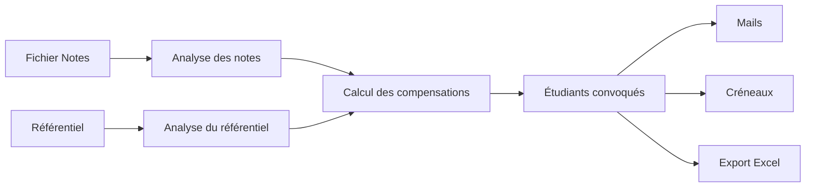
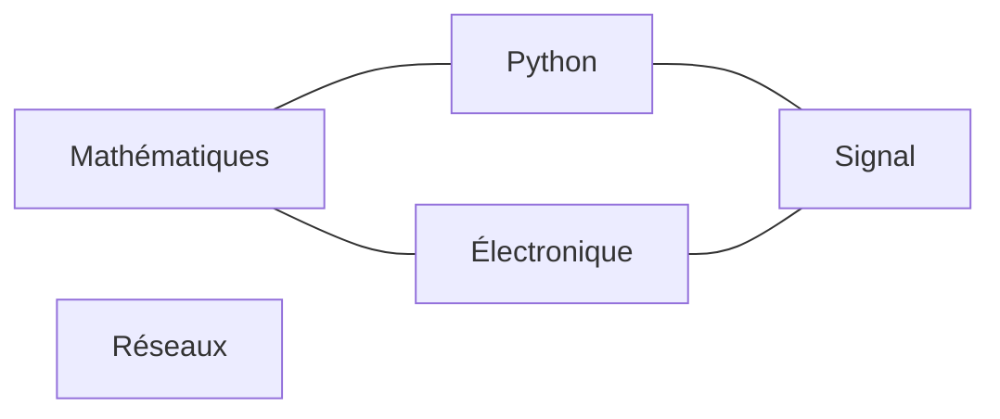
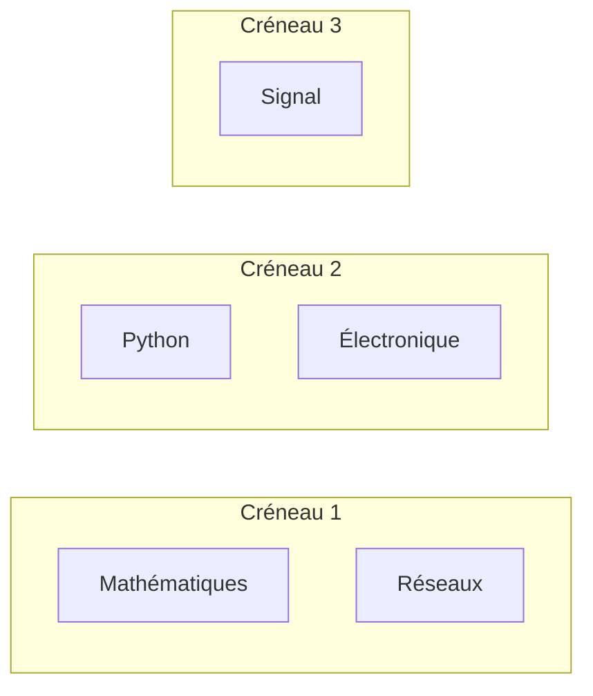
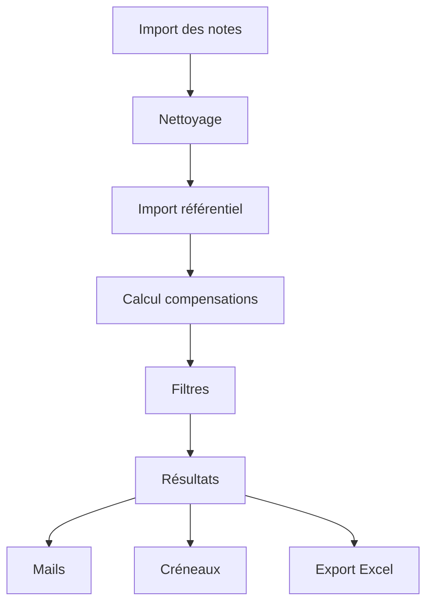
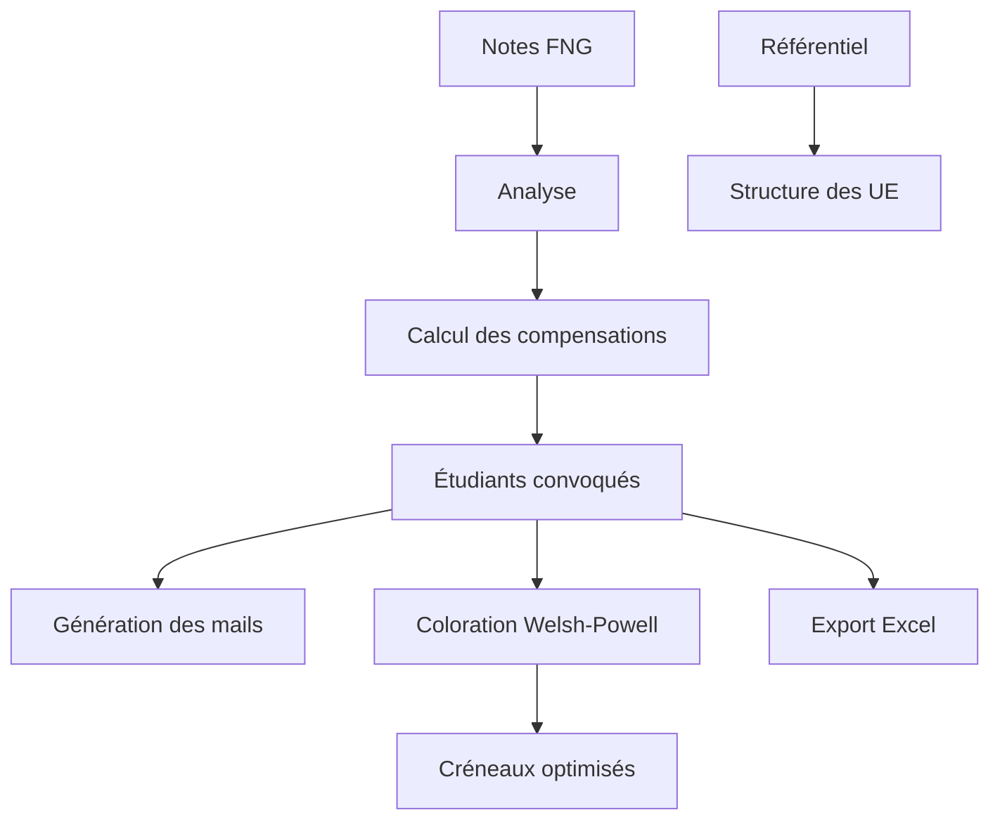

# Répertoire des fonctions

Ce document présente les principales fonctions de l'application **Rattrapages CESI**, leur rôle ainsi que leur enchaînement dans le traitement des données.

---

# Vue d'ensemble

L'application est organisée autour de six grandes étapes :

1. Import des notes étudiants
2. Import du référentiel (cahier des charges)
3. Calcul des compensations par UE
4. Détermination des étudiants convoqués
5. Optimisation des créneaux de rattrapage
6. Génération des exports et des convocations



---

# Chargement des données

## `load_ue_structure()`

Charge le référentiel pédagogique (cahier des charges) et construit la structure des Unités d'Enseignement.

### Rôle

- lecture du fichier Excel du référentiel ;
- récupération des UE ;
- récupération des éléments évaluables ;
- récupération des coefficients.

### Appelée par

- Interface principale lors de l'import du référentiel.

---

# Calcul des compensations

## `match_element()`

Recherche automatiquement la correspondance entre un élément évalué du référentiel et une colonne du fichier de notes.

La fonction est volontairement tolérante afin de gérer les différences de nommage entre les deux fichiers.

### Exemple

```
Programmation Python

↓

Eval - Python
```

---

## `compute_ue_result()`

Fonction centrale de l'application.

Elle calcule le résultat d'une UE.

### Traitements

- récupération des notes ;
- application des coefficients ;
- calcul de la moyenne pondérée ;
- attribution de la mention ;
- validation de l'UE ;
- détection des compensations.

### Résultat

Retourne :

- la moyenne pondérée ;
- la mention de l'UE ;
- si l'UE est validée ;
- si la validation provient d'une compensation.

---

## `is_compensated_for()`

Détermine si une matière en C ou D est finalement compensée grâce à la validation de son UE.

Cette fonction évite de convoquer inutilement un étudiant à un rattrapage.

---

# Génération des mails

## `generate_email()`

Construit automatiquement le mail de convocation.

Deux modes sont disponibles :

- vouvoiement ;
- tutoiement.

La liste des matières est générée automatiquement.

---

## `copy_button_html()`

Crée le bouton permettant de copier le mail dans le presse-papiers.

Cette fonction génère également le code JavaScript nécessaire à la copie.

---

# Gestion des étudiants

## `split_name()`

Sépare automatiquement :

- prénom ;
- nom.

À partir du format utilisé dans les exports FNG.

---

## `short_name()`

Simplifie le nom des matières.

Exemple

```
Eval - Mathématiques

↓

Mathématiques
```

Cette version est utilisée dans toute l'interface.

---

# Création des créneaux de rattrapage

## Algorithme de coloration (Welsh-Powell)

L'une des fonctionnalités principales de l'application consiste à proposer automatiquement des créneaux de rattrapage.

Chaque matière est représentée par un sommet d'un graphe.

Deux matières sont reliées lorsqu'un étudiant est convoqué aux deux rattrapages.

L'application applique ensuite le principe de **coloration de graphe inspiré de l'algorithme de Welsh-Powell** afin de regrouper dans un même créneau les matières compatibles.

### Principe

```
Matière A ───── Matière B

↑
élève commun

↓

Impossible dans le même créneau
```

Les matières ne partageant aucun étudiant reçoivent la même couleur et peuvent donc être planifiées simultanément.

### Schéma



↓



Cette approche permet de réduire le nombre total de créneaux de rattrapage.

---

# Export Excel

## `make_excel()`

Produit le classeur Excel final.

Il génère plusieurs feuilles :

- Vue complète
- Tableau filtré
- Synthèse des rattrapages
- Résultats UE

Les couleurs, styles, bordures et mises en forme sont générés automatiquement.

---

# Interface utilisateur

L'interface Streamlit s'appuie sur plusieurs traitements successifs :



---

# Cheminement global



---

# Fonctions principales

| Fonction | Rôle |
|-----------|------|
| `load_ue_structure()` | Lecture du référentiel |
| `match_element()` | Association référentiel ↔ notes |
| `compute_ue_result()` | Calcul des résultats d'une UE |
| `is_compensated_for()` | Détection des compensations |
| `generate_email()` | Génération des convocations |
| `copy_button_html()` | Copie rapide des mails |
| `split_name()` | Séparation prénom / nom |
| `short_name()` | Simplification des intitulés |
| `make_excel()` | Génération du classeur Excel |

---

# Algorithmes utilisés

- Calcul de moyenne pondérée
- Gestion des coefficients
- Calcul des compensations d'UE
- Correspondance automatique entre référentiel et notes
- Génération automatique de convocations
- **Coloration de graphe (principe de Welsh-Powell)** pour optimiser les créneaux de rattrapage
- Génération automatique d'un classeur Excel formaté
