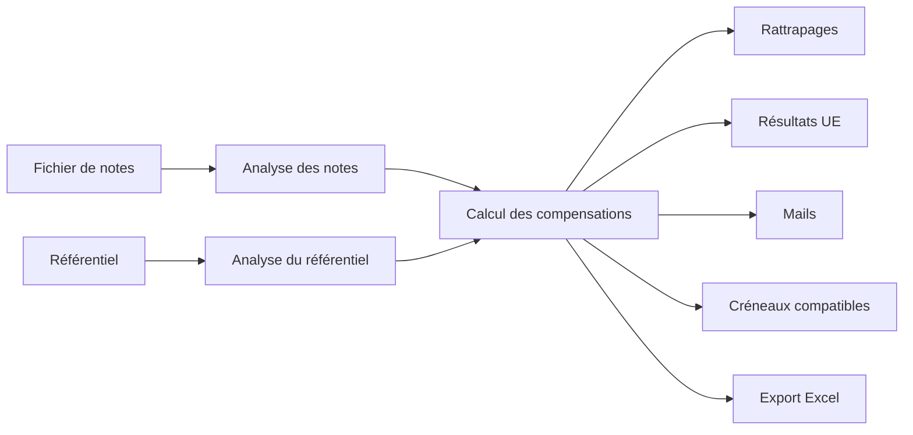

# Rattrapages CESI

Plateforme web développée pour simplifier l'organisation des rattrapages à CESI.

L'application permet aux **Enseignants Responsables Pédagogiques (ERP)** et aux **Assistants Pédagogiques (AP)** d'identifier automatiquement les étudiants convoqués aux rattrapages, de prendre en compte les compensations entre éléments évaluables, de générer les convocations et de préparer les créneaux d'examen.

---

## Accès à l'application

L'application est destinée exclusivement aux équipes pédagogiques de CESI.

Avant son utilisation, il est nécessaire de récupérer depuis la suite **FNG** :

- le fichier de notes des étudiants ;
- le référentiel (cahier des charges) correspondant au semestre.

Ces deux fichiers constituent les données d'entrée de l'application.

---

## Fonctionnalités

- Import des notes des étudiants
- Import du référentiel (cahier des charges)
- Calcul automatique des compensations entre éléments évaluables
- Détermination des étudiants convoqués aux rattrapages
- Visualisation détaillée des résultats par UE
- Récapitulatif par matière
- Génération automatique des mails de convocation
- Proposition de créneaux parallèles compatibles
- Export complet au format Excel

---

# Guide d'utilisation

## 1. Récupération des données

Depuis la suite **FNG**, récupérer :

- le fichier Excel contenant les notes des étudiants ;
- le fichier Excel du référentiel (cahier des charges).

---

## 2. Import des fichiers

Importer le fichier de notes.

Importer ensuite le référentiel correspondant au semestre concerné.

L'application vérifie automatiquement la cohérence des données importées.

---

## 3. Configuration

Choisir :

- le semestre ;
- les matières à exclure si nécessaire ;
- si les cellules vides doivent être considérées comme des absences ;
- l'activation ou non des compensations entre éléments évaluables.

---

## 4. Analyse des résultats

L'application calcule automatiquement :

- les mentions obtenues ;
- les UE validées ;
- les UE validées par compensation ;
- les UE non validées ;
- les étudiants convoqués aux rattrapages.

Les résultats sont présentés sous forme de tableaux et de synthèses graphiques.

---

## 5. Consultation des compensations

L'onglet **Résultats UE** permet de consulter, pour chaque étudiant :

- les éléments évaluables ;
- les coefficients ;
- la moyenne pondérée ;
- la mention obtenue ;
- le statut de validation de chaque UE.

---

## 6. Consultation des rattrapages

L'onglet **Récapitulatif par matière** présente :

- le nombre d'étudiants convoqués ;
- la répartition des mentions C, D et ABS ;
- les compensations éventuelles ;
- la liste des étudiants concernés.

---

## 7. Génération des convocations

L'application génère automatiquement :

- les mails individuels de convocation ;
- un mail récapitulatif destiné à la promotion.

Les textes générés restent entièrement modifiables avant leur envoi.

---

## 8. Recherche de créneaux compatibles

L'application analyse automatiquement les étudiants convoqués afin d'identifier les matières pouvant être programmées simultanément.

Deux matières sont considérées comme compatibles lorsqu'aucun étudiant n'est convoqué aux deux rattrapages.

Une matrice de compatibilité est également générée afin de faciliter l'organisation des examens.

---

## 9. Export Excel

L'application génère un classeur Excel contenant plusieurs feuilles :

- Vue complète des notes ;
- Tableau filtré ;
- Synthèse des rattrapages ;
- Résultats détaillés des UE (si les compensations sont activées).

---

# Architecture

L'application est développée en Python avec **Streamlit**.

Les données sont entièrement traitées en mémoire à partir des fichiers Excel importés.

---

## Technologies

- Python
- Streamlit
- Pandas
- OpenPyXL
- Base64
- Expressions régulières (re)

---

## Auteur

Projet développé par Jules Hamdan, ERP à CESI Toulouse, pour les équipes pédagogiques de CESI afin de simplifier l'organisation des rattrapages.
